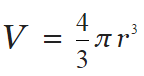

# Machine Exercise 1

For this Machine Exercise:

- Your code should only use the header file *stdio.h*
- Your code should **NOT** use **GLOBAL VARIABLES**
- Π (3.1416) should be initialized as a variable in the main() function

## [ME01_1](me01_1.c) 
Volume and Surface Area of a Sphere (5 pts)

**Inputs:**

1. Radius of the Sphere

**Outputs:**

1. Radius of the Sphere (user input)
2. Volume of the Sphere
3. Surface Area of the Sphere

	

Prompt the user (using printf) to input a number to be the radius of the sphere. Store this number (using scanf) and use this as the radius of a sphere. Compute the volume and surface area of the sphere using this radius. Do **NOT** use the value “1.33” for the constant of the volume of the sphere, perform the proper operation for the fraction. Display the radius (user input) and the volume and surface area of the sphere (using printf).

## [ME01_2](me01_2.c)
Volume and Surface Area of a Cylinder (5 pts)

**Inputs:**

1. Radius of the Cylinder
2. Height of the Cylinder

**Outputs:**

1. Radius of the Cylinder (user input)
2. Height of the Cylinder (user input)
3. Volume of the Cylinder
4. Surface Area of the Cylinder

	

Prompt the user (using printf) to input 2 numbers to be the radius and height of the cylinder, respectively. Store this numbers (using scanf) and use this as the radius and height of a cylinder. Compute the volume and surface area of the cylinder using this radius and height. Display the radius and height (user input) and the volume and surface area of the sphere (using printf).
