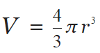
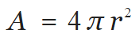
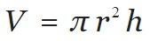
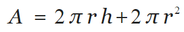

# Machine Exercise 5

## [ME05_1](me05_1.c)
Fibonacci Numbers (2 pts)

Inputs:

1. A positive integer (2 to 30 only)

Outputs:

1. Positive integer (user input)
2. Fibonacci Sequence

F 0 = 0, F 1 = 1	F n = F n-1 + F n-2	F 10 = 0, 1, 1, 2, 3, 5, 8, 13, 21, 34

Prompt the user to input a positive integer. Use this input as the number of sequence of the Fibonacci. Use a function called void get_fibonacci (int firstnumber, int secondnumber, int sequence) that computes for the Fibonacci sequence, displays the result, and calls the same function to get the next Fibonacci number. You cannot use loops on the int main() function but can print the first 2 Fibonacci numbers there. Do an error check (identify this number if it is between 2 and 30, if it is not, print “Invalid Input” and end the program)

## [ME05_2](me05_2.c)
Volume and Surface Area of Sphere and Cylinder (4 pts)

Inputs:

1. Radius (positive integer)
2. Height (positive integer)

Outputs:

1. Radius(user input)
2. Height(user input)
2. Volume of Sphere
3. Surface Area of Sphere
4. Volume of Cylinder
5. Surface Area of Cylinder

Sphere: 	 

Cylinder: 	 

Prompt the user to input a positive integer and use this as a radius and height of a sphere and Cylinder. Compute the volume and surface area of the sphere using this radius. Create a file get_equations.h and declare the functions float get_spherevolume(int radius), float get_spheresurfacearea(int radius), float get_cylindervolume(int radius, int height), float get_cylindersurfacearea(int radius, int height) with PI (3.1416) as a GLOBAL VARIABLE. These functions should not have any “printf” commands and should only do computations. Display the radius and height(user input) and the computed volumes and surface area using the int main() function. Do an error check (identify this number if it is between 1 and above, if it is not, end the program. Zero is not valid)

## [ME05_3](me05_3.c)
Other Header Files (4 pts)

Inputs:

1. Letter choice (A/a, B/b, or C/c only)
2. Respective inputs:

	+ Alphanumeric (Initial input = A/a)
	+ Number and Exponent (Initial input = B/b)
	+ Maximum range (Initial input = C/c)

Outputs:

1. Letter choice (user input)
2. Respective outputs:

	+ Alphabet or Number (Initial input = A/a)
	+ Number and Exponent (Initial input = B/b)
	+ Maximum range (Initial input = C/c)

Prompt the user to input a letter (A, B, C – should accept lowercases) to choose the program function.

If user choose A, prompt the user to input a letter. Identify this letter if it is alphanumeric or not. If it is alphanumeric, identify if it is a number or alphabet. Display all deductions made.

If user choose B, prompt the user to input a two number for the base and exponent, respectively. Compute the exponent using pow() function and display the result.

If user choose C, prompt the user to input a maximum range and generate a random number using rand() up to this maximum range and display the result.

Do an error check for the selection of program function (identify this number if it is A, B, or C, if it is not, end the program) but assume that the input after the program function is selected is always valid.

Hint 1: Choosing an Initial Input would also return a character ‘\n’ to the program. Make sure to ignore this by calling another scanf(“%c”, trash).

Hint 2: Using modulo (%) operator would set the maximum range for the return value of rand()

Hint 3: Compile your codes with an “-lm” operator to recognize the math functions
